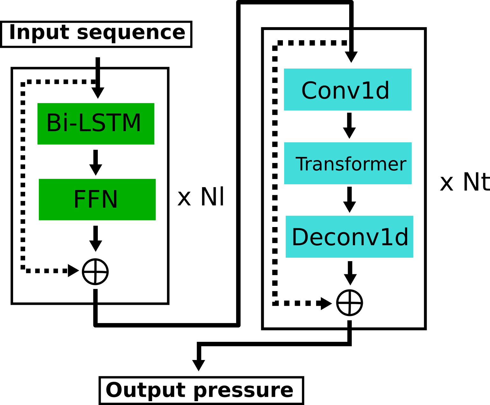

# Part of 1st place solution (LSTM CNN Transformer Encoder) of Google-Brain-Ventilator competition

Competition website: https://www.kaggle.com/c/ventilator-pressure-prediction/overview <br />
Our solution write-up: https://www.kaggle.com/c/ventilator-pressure-prediction/discussion/285256

## Features

Features I use include a few lag and diff features, which are basically previous values of u_in and differences between current u_in and previous u_in. R and C are one-hot encoded with combinations of R and C one-hot encoded as well. Additionally, cumulative u_in integrated over time is also calculated (```area_true```). For more details, see ```add_features``` ```Functions.py```.

## Architecture

My deep learning architecture is a combination of LSTM, 1D convolution, and transformers. LSTM is necessary to model this data because of target pressure's heavy dependence on previous time points. Convolution in conjunction with transformers is a good combination to model global dependencies while making up for transformers' inability to capture local interactions.

Since I'm using a series of many different modules, the network becomes quite deep. Eventually, I ran into some issues with gradient propagation since ```nn.LSTM``` does not have residual connection. Therefore I created a new module called ```ResidualLSTM```, which adds a Feedforward Network (FFN) and connects the input to the LSTM with the output after FFN with a residual connection. Below is a simplified visualization of the architecture (Nl is the number of ResidualLSTM blocks and Nt is the number of convolution+transformer blocks).

<p align="center">
  
</p>

## Packages you need

1. Pytorch
2. Ranger optimizer: https://github.com/lessw2020/Ranger-Deep-Learning-Optimizer
3. Sklearn
4. tqdm

## To run

1. ```run.sh``` is used to run training. The only argument you need to change in run.sh is the ```--path``` argument. Change it to where you have ```train.csv``` and ```test.csv```
3. ```calculate_cv.py``` calculates cv and outputs in ```cv.txt```
3. ```predict.sh``` to make predictions, generate prediction file, and save 10-fold predictions. Similar to 1., change ```--path``` to where you have ```train.csv```, ```test.csv```, and ```sample_submission.csv```

## files
1. ```Network.py``` has the architecture
2. ```Dataset.py``` has the dataset object
3. ```Functions.py``` has some functions i use (mainly add_features)
4. ```Logger.py``` is the custom csv logger i use to log train/val loss and metrics
